# 配置

## VS设置

https://github.com/michaelg29/yt-tutorials/blob/master/CPP/OpenGL/install.md

- 创建一个空工程 和一个main.cpp 

- 添加目录   

  ​	项目-属性-**VC++目录**　（Alt+Enter）

  包含目录

  > $(SolutionDir)\Linking\include;

  库目录
  
  > $(SolutionDir)\Linking\lib;
  
  项目-属性-链接器- 输入-**附加依赖项**
  
  > GLFW\glfw3.lib;opengl32.lib;

- 再工程目录下创建 Linking\include 和 lib 文件夹

  

## GLFW


把include 和 lib-vs2019 复制到 Linking 下对应的文件夹

lib 下的 glfw3.dll 复制到 项目文件夹内（与*.vcxproj同级）

https://www.glfw.org/download.html


## Glad(glsl3.3)

C/C++      OpenGL(gl)=3.3       Profile=Core

GLAD是用来管理OpenGL的函数指针

https://glad.dav1d.de/

把 glad.c 复制到 于main.cpp同级目录，并引入项目


## GLM (OpenGL Mathematics )

[OpenGL Mathematics](http://glm.g-truc.net/) (*GLM*) C++ 数学库 for 基于GLSL的图像处理

https://github.com/g-truc/glm/tags

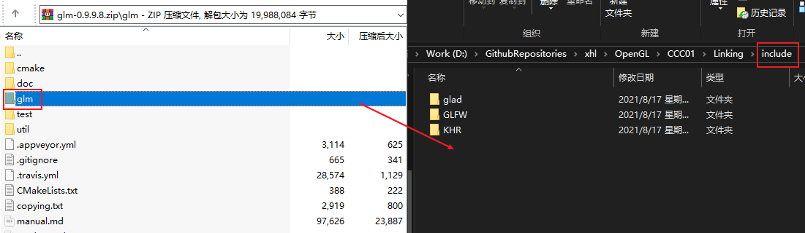

```C
#include <glm/glm.hpp>
#include <glm/gtc/matrix_transform.hpp>
#include <glm/gtc/type_ptr.hpp>

int main(){
	// -------------------- glm test ---------------------------------
	// 定义一个点
	glm::vec4 vec(1.0f, 1.0f, 1.0f, 1.0f);
	glm::mat4 trans = glm::mat4(1.0f);	 // 单位矩阵
	//trans = glm::translate(trans, glm::vec3(1.0f, 1.0f, 0.0f));	// 位移， glm::translate(单位矩阵,(x,y,z))
	//trans = glm::rotate(trans, glm::radians(90.0f), glm::vec3(0.0,0.0,1.0)); // 旋转，glm::rotate(单位矩阵， 旋转度数，旋转轴)
	trans = glm::scale(trans, glm::vec3(0.5, 0.5, 0.5 ));	//缩放 glm::scale(单位矩阵，(x,y,z))

	vec = trans * vec;

	std::cout << vec.x<< ' '<<vec.y<<' '<<vec.z << std::endl;
	// -------------------- glm test ---------------------------------
```

## stb_image

---

https://github.com/nothings/stb

下载 **stb_image.h** 到 .\Linking\include\stb

在src 下面创建stb.cpp

```C++
#define STB_IMAGE_IMPLEMENTATION
#include <stb/stb_image.h>
```

## Assimp

下载安装 CMark

https://cmake.org/download/

下载 Source Code(zip)

https://github.com/assimp/assimp/releases

解压后 打开Cmark

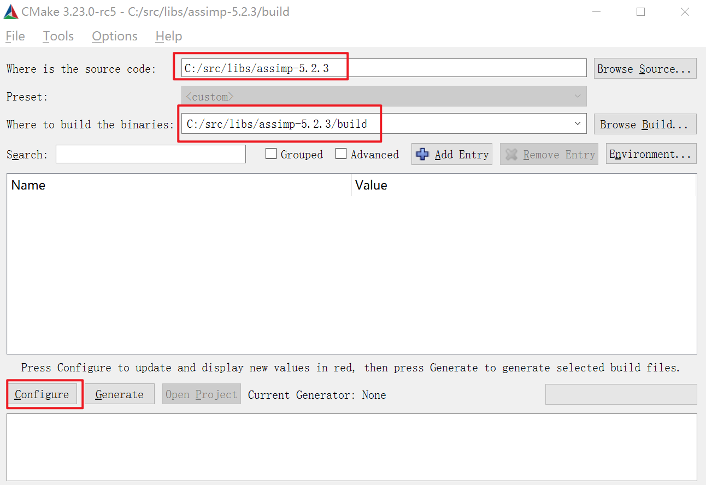

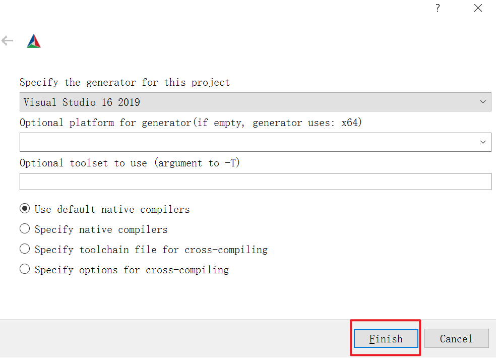

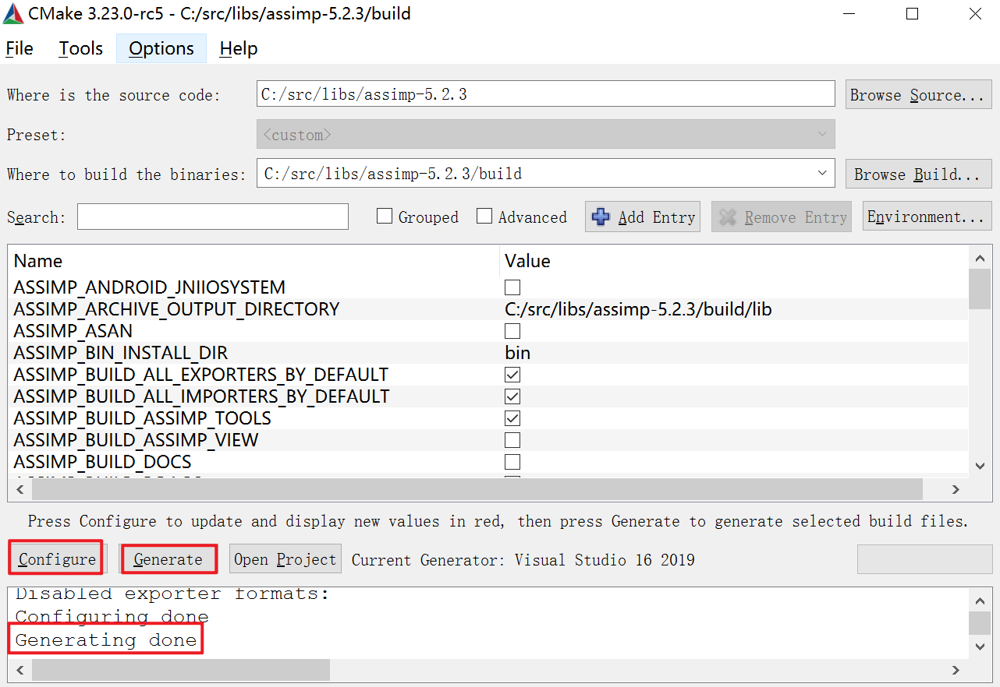

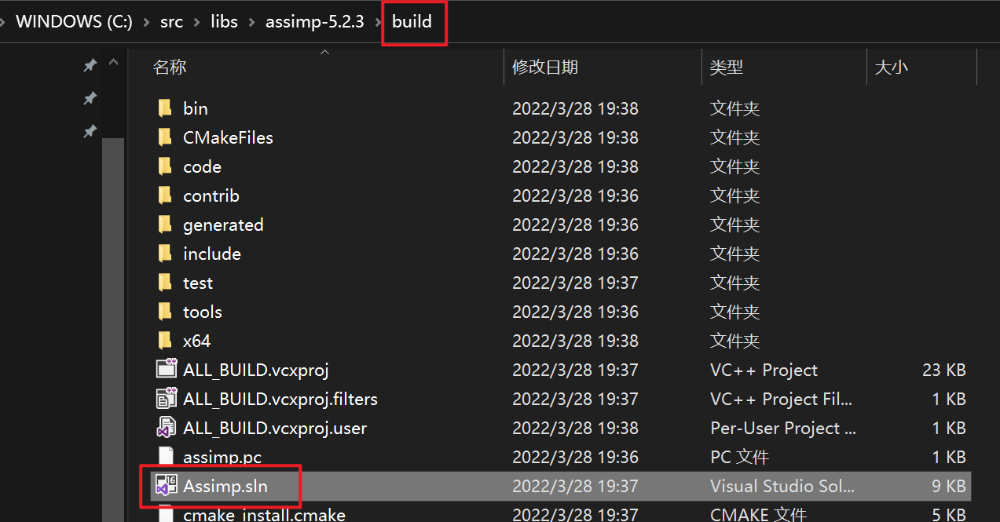

打开后直接 生成解决方案 Ctrl+Shift+B

复制  lib文件

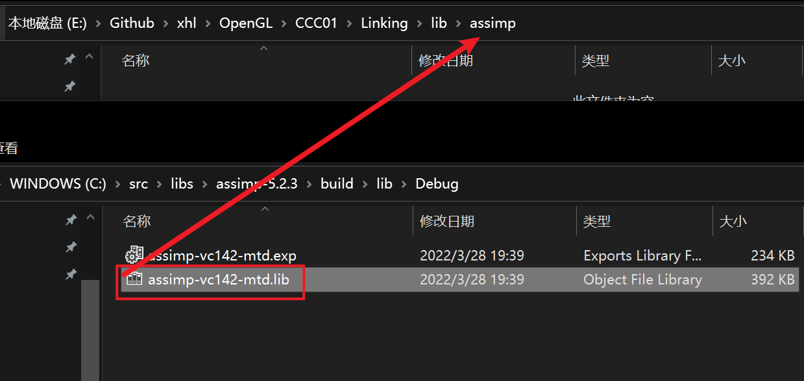

复制 dll文件

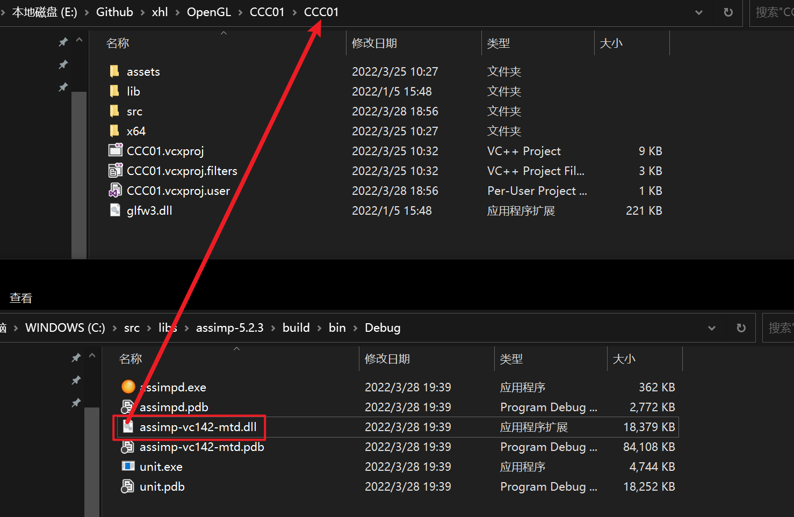

复制 两个 include 文件

 

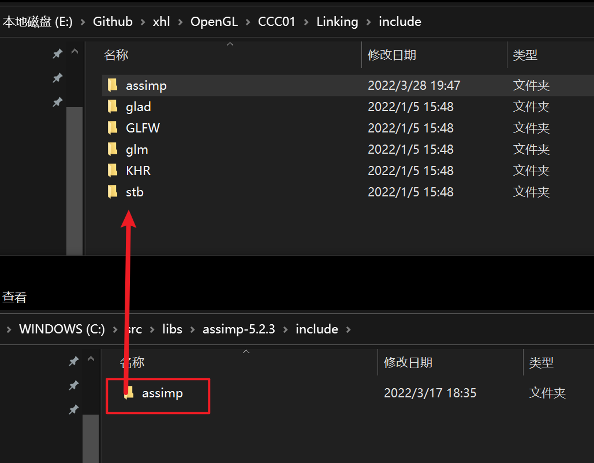

打开VS

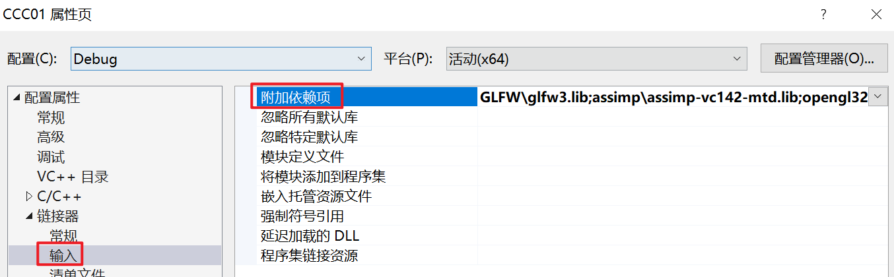

```C
assimp\assimp-vc142-mtd.lib;
```


# 图形渲染管线

## 流程

```C
1. 一堆3D 坐标 -> 2D 坐标

2. 2D坐标 -> 2D像素
    
    2D 坐标： 精确的位置
    2D 像素:  这个点的近似值
```

蓝色区域 可自定义


## 标准化设备坐标(NDC)

NDC = Normalized Device Coordinates

OpenGL仅处理 (x、y、z) -1 ->1(NDC) 范围内 的点, 在范围外的坐标都会被丢弃/裁剪

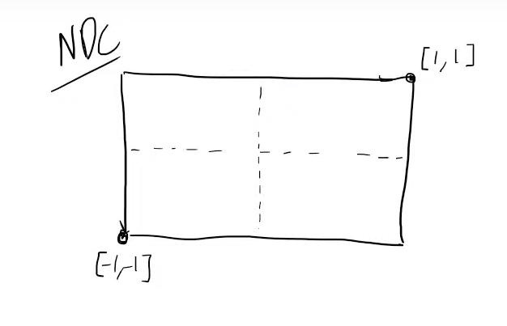

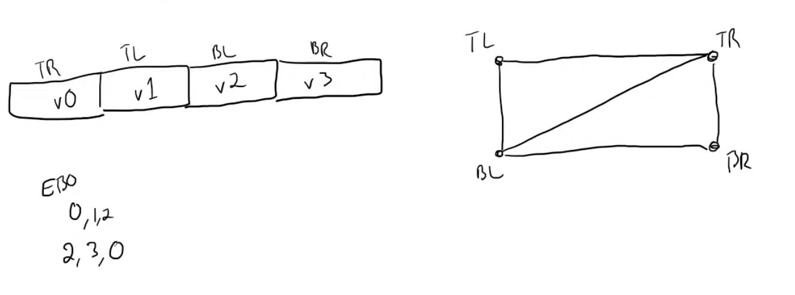


## Shader 

```C
1. 编译VS
2. 编译PS
3. 链接 program
```


shader program 链接了 VS 和 PS

## 顶点数据

https://docs.gl/

```C
glCreateShader(); //创建Shader  GL_VERTEX_SHADER or GL_FRAGMENT_SHADER
glShaderSource(); // 设置Shader Source
glCompileShader( ); // 编译shader
glAttachShader(); // 附加 PS
glLinkProgram( );// 链接 Shader program
glDeleteShader(); // 清除 shader
```


VAO (vertex array object )  - 顶点数据

VBO (vertex buffer object)

​	每个点包含了  v[0]  v[1]  ...  v[n]


# Shader

第一个三角形

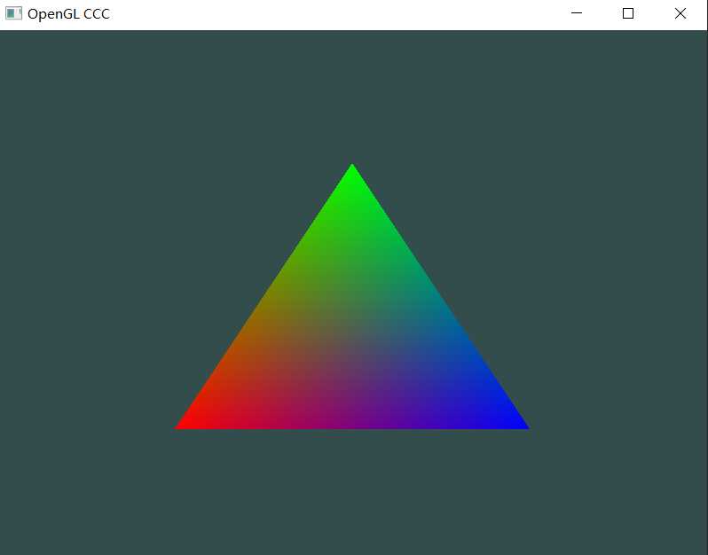

## 创建Shader

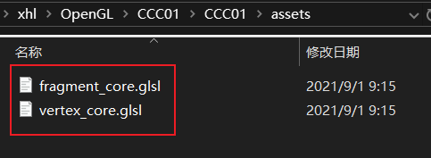

# 常用指令

## Init

```C++
#include "xhl.h"

#include "src/glInit.h"

int main()
{
	GLFWwindow* window = glInit(800, 600, "OpenGL YYDS!!!");

	while (!glfwWindowShouldClose(window)) {
		glClearColor(0.2f, 0.3f, 0.3f, 1.0f);
		glClear(GL_COLOR_BUFFER_BIT);


		glfwPollEvents();
		glfwSwapBuffers(window);
	}
	// 清理缓存
	glfwTerminate();
	return 0;
}
```


## 设置属性

```C
// 设置属性指针

// glVertexAttribPointer(属性ID ,size（float ?vec2/3/4?）,type,normalized,stride，pointer )
//       stride：一个点到下一个点的偏移量   pointer：同一个三角形，不同属性的偏移量
glVertexAttribPointer(0, 3, GL_FLOAT, GL_FALSE, 6 * sizeof(float), (void*)0);
```


## EBO

### 打印 indices

```C++
    for (int i = 0; i < indices.size(); i++)
    {
        if (i % 3 == 0) {
            cout << "(";
        }
        cout << indices.at(i);
        if (i % 3 < 2) cout << ",";
        else cout<<")\n";

    }

```


## 绘制

```c++
glBindVertexArray(VAO);	// 绑定 VAO
		//glDrawElements ( 绘制类型，画几个点，值的类型,偏移几个点)
glDrawElements(GL_TRIANGLES, static_cast<unsigned int>(indices.size()), GL_UNSIGNED_INT, (void*)(0*sizeof(float)));
glBindVertexArray(0); // 指向默认
```

## 线框渲染

```C++
glPolygonMode(GL_FRONT_AND_BACK, GL_LINE); // 线框渲染
glPolygonMode(GL_FRONT_AND_BACK, GL_FILL); // 默认渲染
```


## 激活贴图 

```C++
glActiveTexture(GL_TEXTURE0 + id); //激活 纹理单元 
glActiveTexture(GL_TEXTURE0); // 指向默认
```


## 隐藏鼠标光标

```C++
glfwSetInputMode(window, GLFW_CURSOR, GLFW_CURSOR_DISABLED);
```

## 时间

```c++
// timing
float deltaTime = 0.0f;
float lastFrame = 0.0f;

float currentFrame = static_cast<float>(glfwGetTime());
deltaTime = currentFrame - lastFrame;
lastFrame = currentFrame;
```

##  获取贴图尺寸

```C++
vec2 aaa = textureSize(shadowMap, 0); // 贴图 , mipLevel
```

## 贴图是否可用

```C++
GLboolean glIsTexture(GLuint texture);  // 获取 纹理单元是否可用
 bool xxx = glIsTexture(1);  // 如果存在= 0 不存在 =1
```

# mipmap

```C++
// 修改图片 的 过滤方式:
// 	GL_NEAREST_MIPMAP_NEAREST
// 	GL_LINEAR_MIPMAP_NEAREST
// 	GL_NEAREST_MIPMAP_LINEAR
// 	GL_LINEAR_MIPMAP_LINEAR

glTexParameteri(GL_TEXTURE_2D, GL_TEXTURE_MIN_FILTER, GL_LINEAR_MIPMAP_LINEAR);
```


# MVP

## M

```C
        mat4 M1(1);
        M1 = translate(M1, vec3(2, 0, 0));
        M1 = rotate(M1, radians(90.0f), vec3(-1, 0, 0));
        M1 = scale(M1, vec3(.1, .1, .1));
```

## V

```C++
V = camera.getV();
```

## P

```C++
P = perspective(radians(camera.fov), ratio, 0.1f, 100.0f);
```

